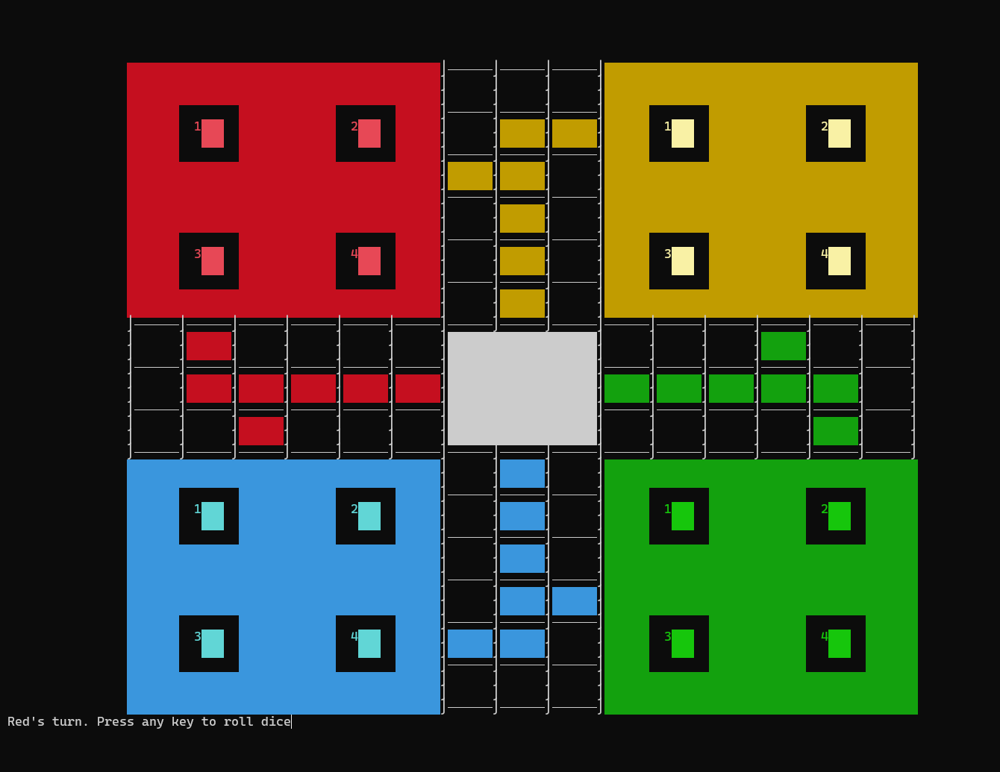

# Ludo Game

A console-based implementation of the classic Ludo board game written in C.

Submitted as the End Semester Project for Fundamentals of Computer Programming at SEECS, NUST.

## Description

This project is a text-based version of the popular Ludo board game where 2-4 players can compete against each other. The game features a colorful console interface with a board representation, dice rolling animation, and turn-based gameplay following standard Ludo rules.

### Features

- Support for 2-4 players
- Colored console interface
- Animated dice rolling
- Full implementation of Ludo rules including:
  - Rolling a 6 to release pieces from home
  - Getting an extra turn on rolling a 6
  - Capturing opponent pieces
  - Safe spots
  - Home column movement
  - Winning by getting all 4 pieces to the finish

## How to Run

### Prerequisites

- Windows operating system
- C compiler (e.g., GCC, MinGW, Visual Studio)

### Compilation and Execution

1. Open a terminal/command prompt
2. Navigate to the directory containing the source file
3. Compile the code:
   ```
   gcc "Project Ludo Final .c" -o ludo.exe
   ```
4. Run the executable:
   ```
   ludo.exe
   ```

### Game Instructions

1. At the start, you will see game instructions
2. Enter the number of players (2-4)
3. Players take turns rolling the dice
4. Follow the on-screen prompts to choose which piece to move
5. The first player to get all 4 pieces to the finish wins!

## Controls

- Press any key to roll the dice
- Enter the number of the piece you want to move when prompted
- When rolling a 6, you can choose to take out a new piece ('t') or move an existing one ('m')

## Screenshot



## Notes

- The game uses Windows-specific console functions and ANSI color codes
- The game board is represented using ASCII characters
- Pieces are represented by numbers 1-4 for each player 